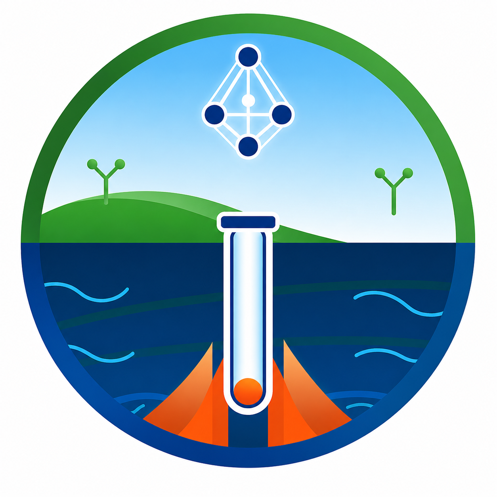

<div align="center">



# GeoThermAI Explorer

### AI-Powered Geothermal Exploration & Decision-Support Platform

**Competition MVP • Version 1.1 • Multilingual**

🇬🇧 English · 🇷🇺 Русский · 🇺🇿 O‘zbek

[🌐 Live MVP](https://geothermai.uz) · [💻 Source Code](https://github.com/rasulsaxobidinov-debug/GeoThermAI-Explorer) · [🏷️ Stable Release](https://github.com/rasulsaxobidinov-debug/GeoThermAI-Explorer/releases/tag/competition-v1.1-multilingual)

</div>

---

## 🚀 Project Overview

**GeoThermAI Explorer** is an AI-assisted geothermal exploration and decision-support platform focused on Uzbekistan.

The platform brings geological, geophysical, geothermal and spatial information into a unified digital environment for **preliminary geothermal prospectivity assessment**.

The Competition MVP demonstrates an end-to-end workflow:

1. Select a study region.
2. Run an AI-assisted geothermal assessment.
3. Evaluate geothermal probability, predicted temperature, estimated depth, risk level and prospectivity.
4. Explore the results through an interactive geospatial map.
5. Switch the interface between English, Russian and Uzbek.

> **Competition MVP scope:** The current version uses demonstration and analytical datasets to demonstrate the complete digital workflow. Its outputs are intended for preliminary assessment and decision support, not as a replacement for detailed geological, geophysical, engineering or investment studies.

---

## 🎯 Problem

Geothermal exploration requires the integration and interpretation of heterogeneous information from geological, geophysical, thermal and spatial sources.

Early-stage assessment can be time-consuming when these indicators are handled separately. Researchers and exploration teams need a practical way to combine spatial information, analytical indicators and preliminary prospectivity assessment in one environment.

---

## 💡 Solution

GeoThermAI Explorer provides a unified interface for preliminary geothermal exploration assessment.

The platform combines:

- AI-assisted analytical indicators
- Interactive GIS visualization
- Regional geothermal prospectivity assessment
- Preliminary temperature and depth estimates
- Exploration risk indication
- Decision-support recommendations
- Multilingual access in English, Russian and Uzbek

The goal is to accelerate early-stage screening and help users identify areas that may deserve more detailed investigation.

---

## 🌍 Geographic Focus

The Competition MVP focuses on **Uzbekistan** and currently provides regional analysis for 13 study regions:

1. Tashkent
2. Samarkand
3. Bukhara
4. Navoi
5. Jizzakh
6. Surkhandarya
7. Kashkadarya
8. Fergana
9. Andijan
10. Namangan
11. Syrdarya
12. Khorezm
13. Karakalpakstan

The architecture is designed to support future expansion toward more detailed local-scale datasets and additional geoscientific layers.

---

## 🧠 AI-Assisted Analysis

The MVP provides the following preliminary indicators:

| Indicator | Description |
|---|---|
| **Geothermal Probability** | Estimated probability of a promising geothermal resource |
| **Temperature Forecast** | Preliminary predicted subsurface temperature |
| **Depth Forecast** | Estimated depth of a potential geothermal target |
| **Risk Level** | Qualitative indication of exploration risk |
| **Prospectivity Index** | Integrated indicator of geothermal potential |

The current Competition MVP demonstrates the analytical workflow using demonstration and analytical datasets. Future versions are intended to incorporate larger validated geological, geophysical, geothermal, remote-sensing and field datasets.

---

## 🗺️ Interactive GIS Visualization

The map provides a spatial view of geothermal exploration indicators, including:

- Regional exploration points
- Thermal anomalies
- Geological and structural indicators
- Fault-related exploration information
- Prospectivity targets
- Interactive markers and information panels

The GIS interface is designed to make analytical results easier to interpret spatially.

---

## 🌐 Multilingual Interface

Competition MVP v1.1 supports three interface languages:

- 🇬🇧 **English**
- 🇷🇺 **Russian**
- 🇺🇿 **Uzbek**

Users can switch languages directly inside the application. The selected language is preserved in the browser for subsequent visits.

---

## 🚀 Quick Demo

Open the Live MVP and follow this workflow:

1. Open **GeoThermAI Explorer**.
2. Click **Start Analysis**.
3. Select one of the 13 study regions.
4. Click **Run AI Analysis**.
5. Review the AI-assisted results.
6. Explore the results on the interactive map.
7. Switch between English, Russian and Uzbek using the language selector.
8. Start a new analysis if required.

**Live MVP:** https://geothermai.uz

---

## ⭐ Key Features

### Landing Page

- GeoThermAI Explorer introduction
- Uzbekistan-focused geothermal exploration concept
- Clear Start Analysis workflow
- Responsive interface
- Multilingual language selector

### Analysis Module

Users can:

1. Select an administrative region.
2. Run an AI-assisted analysis.
3. Receive geothermal assessment indicators.
4. Review analytical results.
5. Explore results on an interactive map.
6. Start a new analysis.

### Analysis Results

The interface presents:

- Geothermal probability
- Temperature forecast
- Depth forecast
- Risk level
- Prospectivity index
- Exploration recommendation

---

## 🛠️ Technology Stack

### Frontend

- React 18
- Vite
- React Leaflet
- Leaflet
- Responsive CSS

### Backend

- Python
- FastAPI
- REST API
- Uvicorn

### AI Engine

- Python
- FastAPI
- AI-assisted analytical workflow
- Geospatial and numerical processing

### Database

- PostgreSQL
- PostGIS

### Infrastructure

- Podman / Podman Compose
- Docker-compatible container architecture
- Nginx for production frontend serving
- Cloudflare Tunnel for secure public access

### Development

- Linux
- Git
- GitHub

---

## 🏗️ System Architecture

GeoThermAI Explorer follows a modular service-oriented architecture:

```text
                    ┌──────────────────────────┐
                    │      User / Researcher   │
                    └────────────┬─────────────┘
                                 │
                                 ▼
                    ┌──────────────────────────┐
                    │ React + Vite Frontend    │
                    │ Interactive GIS Interface │
                    └────────────┬─────────────┘
                                 │ REST API
                                 ▼
                    ┌──────────────────────────┐
                    │ FastAPI Backend           │
                    │ Application API           │
                    └────────────┬─────────────┘
                                 │
                    ┌────────────┴─────────────┐
                    │                          │
                    ▼                          ▼
          ┌──────────────────┐       ┌────────────────────┐
          │ AI Engine        │       │ PostgreSQL/PostGIS │
          │ Analysis Service │       │ Spatial Database   │
          └──────────────────┘       └────────────────────┘
```

---

## 📁 Project Structure

```text
GeoThermAlExplorer/
├── frontend/
│   ├── public/
│   │   └── logo.png
│   ├── src/
│   │   ├── App.jsx
│   │   ├── components/
│   │   └── ...
│   ├── package.json
│   └── Dockerfile
│
├── backend/
│   ├── app/
│   │   └── main.py
│   ├── requirements.txt
│   └── Dockerfile
│
├── ai-engine/
│   ├── app/
│   │   └── main.py
│   ├── requirements.txt
│   └── Dockerfile
│
├── datasets/
├── docs/
├── docker-compose.yml
├── README.md
├── LICENSE
└── .gitignore
```

---

## 🏆 Competition MVP

**Version:** `v1.1 Multilingual`

**Stable Git tag:** `competition-v1.1-multilingual`

The current competition version demonstrates:

- A working public web MVP
- AI-assisted geothermal analysis
- Interactive GIS visualization
- 13 Uzbekistan study regions
- English / Russian / Uzbek interface
- Modular frontend, backend and AI-engine architecture
- Containerized deployment
- Public HTTPS access

---

## 🔬 Scientific and Technical Scope

GeoThermAI Explorer is designed as a **preliminary decision-support platform**.

The Competition MVP should not be interpreted as:

- a final geological model;
- a certified geothermal resource estimate;
- a substitute for field investigation;
- a substitute for detailed geophysical interpretation;
- an engineering feasibility study;
- or an investment decision system.

The purpose of the MVP is to demonstrate how AI-assisted analytical workflows and geospatial visualization can support early-stage geothermal exploration.

---

## 🎯 Vision

To develop an intelligent digital platform that accelerates geothermal exploration in Uzbekistan by combining geospatial analysis, scientific data and Artificial Intelligence.

## 🎯 Mission

To provide researchers, government institutions and energy-sector stakeholders with an accessible AI-assisted environment for preliminary geothermal resource assessment and exploration planning.

---

## 👥 Target Users

- Geological and geophysical research institutions
- Government agencies
- Energy companies
- Universities and research centers
- Geological survey organizations
- Geothermal exploration teams
- Investors and development organizations

---

## 🌱 Expected Impact

GeoThermAI Explorer is intended to contribute to:

- Faster preliminary geothermal screening
- More accessible interpretation of heterogeneous spatial information
- Better visualization of exploration indicators
- More structured early-stage exploration planning
- Identification of areas requiring further investigation
- Digital transformation of geothermal exploration workflows
- Sustainable geothermal energy development in Uzbekistan

---

## 🛣️ Roadmap

### Current — Competition MVP

- [x] Interactive web platform
- [x] Uzbekistan regional map
- [x] 13 study regions
- [x] AI-assisted analysis workflow
- [x] Geothermal prospectivity indicators
- [x] Interactive GIS visualization
- [x] English / Russian / Uzbek interface
- [x] Containerized deployment
- [x] Public HTTPS MVP

### Future Development

- [ ] Integration of larger validated geoscientific datasets
- [ ] Remote-sensing data integration
- [ ] Expanded geological and geophysical layers
- [ ] More detailed local-scale analysis
- [ ] Model validation against field observations
- [ ] Advanced uncertainty quantification
- [ ] Research and operational decision-support modules
- [ ] Expanded regional coverage

---

## 🔗 Competition Resources

- 🌐 **Live MVP:** https://geothermai.uz
- 💻 **Source Code:** this GitHub repository
- 🏷️ **Stable Version:** `competition-v1.1-multilingual`
- 🎥 **Demo Video:** to be added
- 📊 **Presentation:** to be added

---

## 📄 License

This project is distributed under the license included in the repository.

See [`LICENSE`](LICENSE) for details.

---

## 📌 Project Status

**Competition MVP — v1.1 Multilingual**

GeoThermAI Explorer is an actively developed research and technology prototype focused on AI-assisted geothermal exploration and decision support for Uzbekistan.

<div align="center">

### 🌍 GeoThermAI Explorer

**AI-powered geothermal exploration for Uzbekistan**

🌐 https://geothermai.uz

</div>
